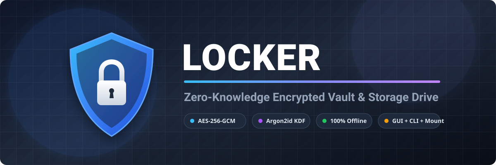
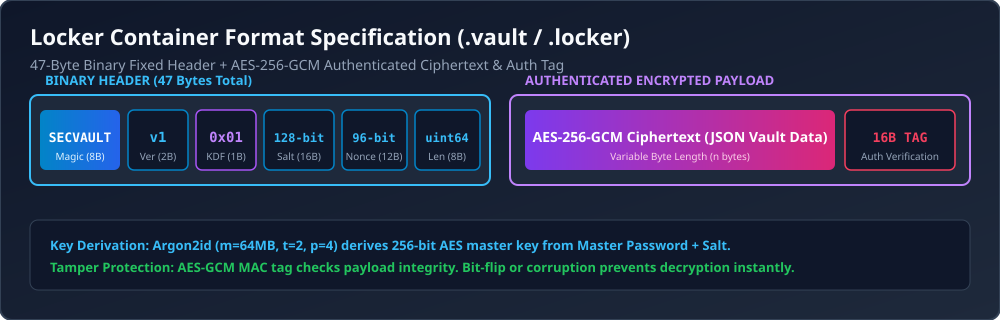
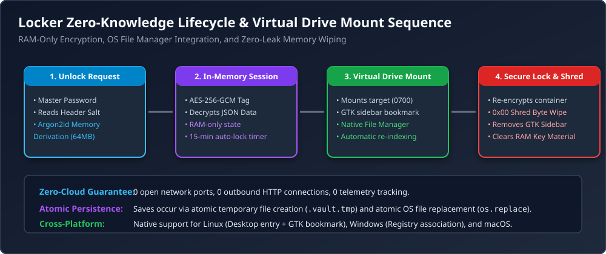
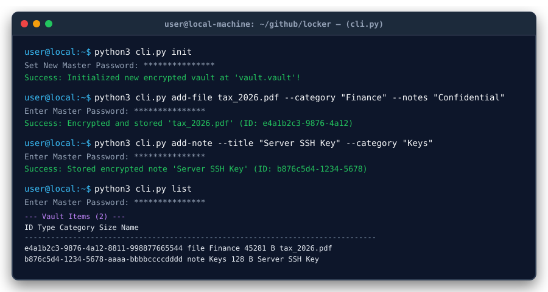

<p align="center">
  
</p>

<p align="center">
  <b>A 100% Offline, Zero-Knowledge Local Encrypted Container Vault & Virtual Drive Mount</b>
</p>

<p align="center">
  <a href="LICENSE"></a>
  <a href="https://www.python.org/"></a>
  <a href="SECURITY.md"></a>
  <a href="SECURITY.md"></a>
  
  
</p>

---

## 🔒 What is Locker?

**Locker** is a local, zero-knowledge encrypted vault application designed to securely store files, secret notes, private keys, and credentials on your workstation **without relying on external cloud providers or internet connections**.

All encryption, decryption, key derivation, and file operations take place **locally in RAM**. Master keys are never written to disk, and temporary mounted files are overwritten with zero bytes (`0x00`) upon locking.

```
                  +-----------------------------------+
                  |   Local Workstation (Offline)     |
                  |                                   |
  [User Input] -->|  Argon2id (64MB) -> AES-256-GCM   |--> [vault.vault]
                  |  In-Memory Key -> Direct RAM Sync |   (Single Container)
                  +-----------------------------------+
```

---

## ✨ Key Features

| Feature | Description |
|---|---|
| **🛡️ Military-Grade Security** | **AES-256-GCM** authenticated encryption + **Argon2id** (memory-hard password hashing). |
| **📦 Single Container Storage** | Compiles all encrypted files, notes, metadata, and folders into an atomic binary container (`vault.vault`). |
| **💾 Virtual Drive Mount** | Mounts vault contents directly into your OS file manager (Thunar, Nautilus, Explorer) with auto GTK bookmarks. |
| **🧹 Secure File Shredder** | Overwrites temporary extracted files with zero bytes (`0x00`) before unmounting to prevent recovery. |
| **🖥️ Native Desktop GUI** | Clean Tkinter/TTK application featuring drag-and-drop, category search, favorites, and password generator. |
| **💻 Power-User CLI** | Complete command-line tool (`cli.py`) for headless servers, SSH terminals, and scriptable workflows. |
| **⚡ Atomic File Persistence** | Writes updates via temporary atomic swaps (`.vault.tmp`), preventing vault corruption during power loss. |
| **🌐 100% Offline Guarantee** | 0 open network ports, 0 outbound HTTP connections, 0 telemetry tracking. |

---

## 📐 Architecture & Binary Container Specification

Locker container files (`.vault` / `.locker`) feature a **47-byte fixed binary header** bound to an **AES-256-GCM payload and 16-byte authentication tag**.



For an in-depth breakdown of key derivation, RAM lifecycle, and virtual drive mounting, see [**ARCHITECTURE.md**](ARCHITECTURE.md).

---

## 🚀 Quick Start

### 1. Requirements & Installation

Clone the repository and install required cryptographic dependencies:

```bash
# Clone the repository
git clone https://github.com/amitpadhan525/locker.git
cd locker

# Create & activate a Python virtual environment
python3 -m venv venv
source venv/bin/activate  # On Windows: venv\Scripts\activate

# Install dependencies
pip install cryptography pyperclip
```

---

### 2. Running the Desktop Application (GUI)

Launch the native desktop interface:

```bash
python3 app.py
```

<p align="center">
  
</p>

- **Initial Setup**: Set your Master Password upon first launch.
- **Drag & Drop**: Drag documents, PDFs, images, or archives directly into the app window to encrypt.
- **Virtual Drive Mount**: Click **Mount Drive** to open vault contents as an external folder in your file manager.
- **Lock Vault**: Click **Lock** or press `Ctrl+L` to immediately flush keys from RAM.

---

### 3. Using the Command Line Interface (CLI)

For headless systems, SSH servers, or terminal power users, use [`cli.py`](file:///home/amit/github/locker/cli.py):



```bash
# 1. Initialize a new encrypted vault
python3 cli.py init

# 2. Check vault file status
python3 cli.py status

# 3. Add an encrypted file
python3 cli.py add-file /path/to/confidential.pdf --category "Finance" --notes "Tax Return 2026"

# 4. Add a secure text note or credential
python3 cli.py add-note --title "Server SSH Key" --content "ssh-rsa AAAAB3NzaC1..." --category "Keys"

# 5. List stored items
python3 cli.py list

# 6. Extract/Decrypt an item to disk
python3 cli.py extract --id <ITEM_UUID> --out decrypted_document.pdf

# 7. Delete an item from vault
python3 cli.py delete --id <ITEM_UUID>

# 8. Re-encrypt vault with a new master password
python3 cli.py change-password
```

---

## 🔒 Security Specifications & Threat Model

| Security Aspect | Specification |
|---|---|
| **Cipher** | **AES-256-GCM** (Galois/Counter Mode) with 128-bit MAC authentication tag |
| **Key Derivation (KDF)** | **Argon2id** (64 MB Memory, 2 Iterations, 4 Parallelism Lanes) |
| **KDF Fallback** | **PBKDF2 HMAC-SHA256** (600,000 Iterations) |
| **Salt & Nonce** | 128-bit CSPRNG Salt (`os.urandom(16)`), 96-bit CSPRNG Nonce (`os.urandom(12)`) |
| **Header Binding** | Associated Data (AD) binds header magic `SECVAULT` to MAC tag |
| **Inactivity Auto-Lock**| Purges master key and decrypted payload from RAM after 15 minutes |

For responsible disclosure procedures and complete threat model details, see [**SECURITY.md**](SECURITY.md).

---

## 🧪 Automated Testing & CI

Locker includes automated unit tests covering key derivation, encryption/decryption integrity, tamper detection, CLI subcommands, and zeroing procedures.

Run the test suite:

```bash
python3 -m unittest discover -p "test_*.py"
```

Or run with coverage via `pytest`:

```bash
pytest --cov=.
```

---

## 📚 Documentation & Developer Resources

- [**ARCHITECTURE.md**](ARCHITECTURE.md) — Technical breakdown of binary container layout, key derivation pipeline, and secure unmounting.
- [**SECURITY.md**](SECURITY.md) — Security policy, cryptographic parameters, threat model, and vulnerability disclosure protocol.
- [**CONTRIBUTING.md**](CONTRIBUTING.md) — Development setup, PEP 8 standards, memory-zeroing rules, and PR workflow.
- [**ROADMAP.md**](ROADMAP.md) — Product vision from v1.1 CLI JSON output to FUSE filesystems and Post-Quantum hybrid algorithms.
- [**ISSUES.md**](ISSUES.md) — Pre-formulated **Good First Issue** and **Help Wanted** community tasks ready to claim!

---

## 📜 License

Locker is open-source software licensed under the [**GNU General Public License v3.0 (GPL-3.0)**](LICENSE).

You are free to use, modify, and distribute this software under the terms of the GPL-3.0 license. Any derivative works or distributions must remain open-source under the same GPL v3.0 license.
